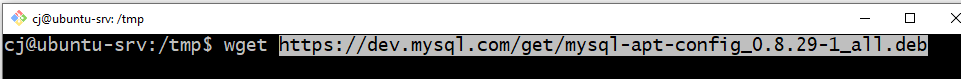

### Используя команду cat в терминале операционной системы Linux, создать два файла Домашние животные (заполнив файл собаками, кошками,хомяками) и вьючные животными заполнив файл Лошадьми, верблюдами и ослы, а затем объединить их. Просмотреть содержимое созданного файла. Переименовать файл, дав ему новое имя (Друзья человека).

### создаём и наполняем файлы:

### переименовывание файла
    

---

###  Создать директорию, переместить файл туда.

---

### Подключить дополнительный репозиторий MySQL. Установить любой пакет из этого репозитория. Установить и удалить deb-пакет с помощью dpkg. Выложить историю команд в терминале ubuntu

### скачиваем deb пакет с сайта разработчика при помощи команды `wget`:

### установка deb пакета кмандой `dpkg`:

### просмотр списка дополнительных репозиториев:

### обновление списка пакетов командой `apt update`:

### После ввода команды: 
    sudo apt install mysql-server
### входим в оболочку MySQL

### поиск необходимого пакета `nano` и его последующее удаление:

---

### Нарисовать диаграмму, в которой есть класс родительский класс, домашние животные и вьючные животные, в составы которых в случае домашних животных войдут классы: собаки, кошки, хомяки, а в класс вьючные животные войдут: Лошади, верблюды и ослы.

---