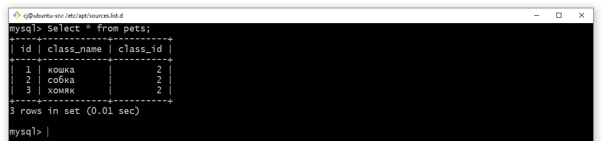

### Используя команду cat в терминале операционной системы Linux, создать два файла Домашние животные (заполнив файл собаками, кошками,хомяками) и вьючные животными заполнив файл Лошадьми, верблюдами и ослы, а затем объединить их. Просмотреть содержимое созданного файла. Переименовать файл, дав ему новое имя (Друзья человека).

### создаём и наполняем файлы:

### переименовывание файла
    

---

###  Создать директорию, переместить файл туда.

---

### Подключить дополнительный репозиторий MySQL. Установить любой пакет из этого репозитория. Установить и удалить deb-пакет с помощью dpkg. Выложить историю команд в терминале ubuntu

### скачиваем deb пакет с сайта разработчика при помощи команды `wget`:

### установка deb пакета кмандой `dpkg`:

### просмотр списка дополнительных репозиториев:

### обновление списка пакетов командой `apt update`:

### После ввода команды: 
    sudo apt install mysql-server
### входим в оболочку MySQL

### поиск необходимого пакета `nano` и его последующее удаление:

---

### Нарисовать диаграмму, в которой есть класс родительский класс, домашние животные и вьючные животные, в составы которых в случае домашних животных войдут классы: собаки, кошки, хомяки, а в класс вьючные животные войдут: Лошади, верблюды и ослы.

---

### В подключенном MySQL репозитории создать базу данных “Друзья человека”

    CREATE DATABASE HumanFriends;
    SHOW DATABASES;

---

### Создать таблицы с иерархией из диаграммы в БД
### Заполнить низкоуровневые таблицы именами(животных), командами которые они выполняют и датами рождения

    USE HumanFriends;

    CREATE TABLE IF NOT EXISTS animals  
    (
        id INT PRIMARY KEY AUTO_INCREMENT, 
        class_name VARCHAR(30)
    );

    INSERT INTO animals (class_name)
    VALUES ('вьючные'), ('домашние');

    CREATE TABLE IF NOT EXISTS pack_animals
    (
        id INT PRIMARY KEY AUTO_INCREMENT,
        class_name VARCHAR (30),
        class_id INT,
        FOREIGN KEY (class_id) REFERENCES animals (id)
    );

    INSERT INTO pack_animals (class_name, class_id)
    VALUES 
        ('лошадь', 1), 
        ('осёл', 1),
        ('верблюд', 1)
        ;

    CREATE TABLE IF NOT EXISTS pets
    (
        id INT PRIMARY KEY AUTO_INCREMENT,
        class_name VARCHAR (30),
        class_id INT,
        FOREIGN KEY (class_id) REFERENCES animals (Id)
    );

    INSERT INTO pets (class_name, class_id)
    VALUES
        ('кошка', 2),
        ('собака', 2),
        ('хомяк', 2)
        ;

    CREATE TABLE IF NOT EXISTS horses 
    (       
        id INT PRIMARY KEY AUTO_INCREMENT, 
        name VARCHAR(30), 
        birthday DATE,
        commands VARCHAR(100),
        class_id INT,
        FOREIGN KEY (class_id) REFERENCES pack_animals (id)
    );
    
    INSERT INTO horses (name, birthday, commands, class_id)
    VALUES
        ('Буран', '2024-01-13', 'Хоп, тише, шагом', 1),
        ('Гранат', '2023-10-01', 'Хоп, тише, шагом', 1),
        ('Юлий', '2020-07-05', 'Хоп, тише, шагом', 1)
        ;

    CREATE TABLE IF NOT EXISTS camels 
        (       
            id INT PRIMARY KEY AUTO_INCREMENT, 
            name VARCHAR(30), 
            birthday DATE,
            commands VARCHAR(100),
            class_id INT,
            FOREIGN KEY (class_id) REFERENCES pack_animals (id)
        );

    INSERT INTO camels (name, birthday, commands, class_id)
    VALUES
        ('Лила', '2024-03-28', 'ГИТ, ДУРР, ХАП-ХАП-ХАП-ХАП', 2),
        ('Омлет', '2020-01-14', 'ГИТ, ДУРР, ХАП-ХАП-ХАП-ХАП', 2),
        ('Джоси', '2010-12-13', 'ГИТ, ДУРР, ХАП-ХАП-ХАП-ХАП', 2)
        ;

    CREATE TABLE IF NOT EXISTS donkeys 
        (       
            id INT PRIMARY KEY AUTO_INCREMENT, 
            name VARCHAR(30), 
            birthday DATE,
            commands VARCHAR(100),
            class_id INT,
            FOREIGN KEY (class_id) REFERENCES pack_animals (id)
        );

    INSERT INTO donkeys (name, birthday, commands, class_id)
    VALUES
        ('Серена', '2015-08-01', 'стой, вперед', 3),
        ('Ранго', '2018-08-10', 'стой, вперед', 3),
        ('Клаксон', '2022-01-06', 'стой, вперед', 3)
        ;
    

    CREATE TABLE IF NOT EXISTS cats 
        (       
            id INT PRIMARY KEY AUTO_INCREMENT, 
            name VARCHAR(30), 
            birthday DATE,
            commands VARCHAR(100),
            class_id INT,
            FOREIGN KEY (class_id) REFERENCES pets (id)
        );

    INSERT INTO cats (name, birthday, commands, class_id)
    VALUES
        ('Мурзик', '2015-08-01', 'кыс-кыс, куда б***ь!!!', 1),
        ('Васька', '2018-08-10', 'кыс-кыс, куда б***ь!!!', 1),
        ('Трактор', '2021-04-10', 'кыс-кыс, куда б***ь!!!', 1)
        ;

    CREATE TABLE IF NOT EXISTS dogs 
        (       
            id INT PRIMARY KEY AUTO_INCREMENT, 
            name VARCHAR(30), 
            birthday DATE,
            commands VARCHAR(100),
            class_id INT,
            FOREIGN KEY (class_id) REFERENCES pets (id)
        );

    INSERT INTO dogs (name, birthday, commands, class_id)
    VALUES
        ('Рекс', '2015-08-01', 'сидеть, лежать, фу', 2),
        ('Найда', '2018-08-10', 'сидеть, лежать, фу', 2),
        ('Альма', '2021-11-16', 'сидеть, лежать, фу', 2)
        ;

    CREATE TABLE IF NOT EXISTS hamsters 
        (       
            id INT PRIMARY KEY AUTO_INCREMENT, 
            name VARCHAR(30), 
            birthday DATE,
            commands VARCHAR(100),
            class_id INT,
            FOREIGN KEY (class_id) REFERENCES pets (id)
        );

    INSERT INTO hamsters (name, birthday, commands, class_id)
    VALUES
        ('Хома', '2024-01-10', 'на', 3),
        ('Барсук', '2024-02-20', 'на', 3),
        ('Медведь', '2023-03-06', 'на', 3)
        ;

---
### Удалив из таблицы верблюдов, т.к. верблюдов решили перевезти в другой питомник на зимовку. Объединить таблицы лошади, и ослы в одну таблицу.

    DELETE FROM camels;

    CREATE TABLE IF NOT EXISTS horses_donkeys 
        (
            id INT PRIMARY KEY AUTO_INCREMENT)
        AS
        SELECT name, birthday, commands, class_id  FROM horses
        UNION
        SELECT name, birthday, commands, class_id FROM donkeys
        ;

    ALTER TABLE horses_donkeys
    ADD FOREIGN KEY (class_id) REFERENCES pack_animals (id);

---

### Создать новую таблицу “молодые животные” в которую попадут все животные старше 1 года, но младше 3 лет и в отдельном столбце с точностью до месяца подсчитать возраст животных в новой таблице

    CREATE TEMPORARY TABLE tmp
        AS
        SELECT *, 'лошадь' AS animal FROM horses
        UNION SELECT *, 'осел' AS animal FROM donkeys
        UNION SELECT *, 'кот' AS animal FROM cats
        UNION SELECT *, 'собака' AS animal FROM dogs
        UNION SELECT *, 'хомяк' AS animal FROM hamsters
        ;

    CREATE TABLE IF NOT EXISTS yang_animals 
        (
            id INT PRIMARY KEY AUTO_INCREMENT
        )
        AS
        SELECT 
            name,
            birthday,
            commands,
            animal,
            TIMESTAMPDIFF(MONTH, Birthday, CURDATE()) AS Age_in_month
        FROM tmp 
        WHERE birthday BETWEEN ADDDATE(curdate(), INTERVAL -3 YEAR) AND ADDDATE(CURDATE(), INTERVAL -1 YEAR)
        ;

---

### Объединить все таблицы в одну, при этом сохраняя поля, указывающие на прошлую принадлежность к старым таблицам.

    SELECT null as pets, class_id as pack_animals, name, birthday, commands FROM horses
    UNION
    Select null as pets, class_id as pack_animals, name, birthday, commands FROM donkeys
    UNION
    Select class_id as pets, null as pack_animals, name, birthday, commands FROM cats
    UNION
    Select class_id as pets, null as pack_animals, name, birthday, commands FROM dogs
    UNION
    Select class_id as pets, null as pack_animals, name, birthday, commands FROM hamsters
    ;

---